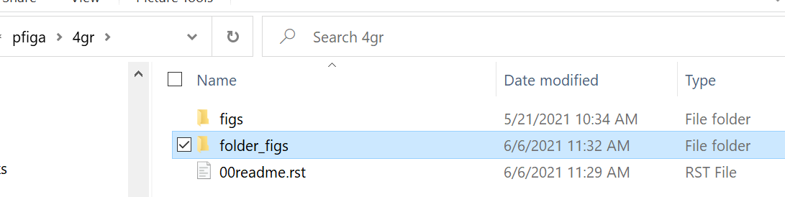
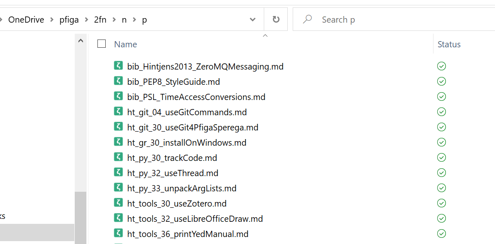

folder_figs 
###########################

All figures here are related to the display of folder structures 
in a computer system. Specifically, we have the following ones:

**img01.png**. This is a screenshot of the structure of the 4gr folder.  
Suggested captions: 

- Structure of the local 4gr folder.
- Folders and files in the 4gr folder.

**img02.png**. This is a screenshot of the structure of the local 3fn folder. 
There is an img02a.png file; no need to include this file. Suggested captions: 

- A sample of files for Flex-C-Notes.
- Flex-C-Notes in the 2fn folder.
   

