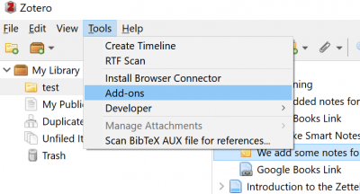

more_figs 
###########################

**img01.png**. This is a screenshot about how to control Zotero. 
It is obtained from xxx (source if this is obtained somewhere 
on the Internet). Suggested captions: 

- Including **Add-ons** in Zotero.
- Illustration of the **Add-ons** window of Zotero.

**img04.svg**. Connection of the Vent, Worker, and Sink sockets. 
The file is produced by using LibreOffice Draw, and the source file 
is saved locally. Suggested captions: 

- Ports and connections of the Vent, Worker, and Sink sockets.
- Interconnection of the Vent, Worker, and Sink modules.

.. image:: img04.svg
   :width: 300
